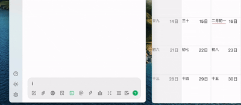

# MCP Server for apple calendar

This is a simple mcp-server that allows you to use claude or other client to generate a calendar event.

## How to use

### Install dependencies and build

```bash
pnpm i
pnpm build
```

### Inpesctor tool

```bash
pnpm inspector
```

### MCP Server configration

Replace the `args` with your own path

```json
{
  "mcpServers:": {
    "mcp-server-apple-calendar": {
      "command": "node",
      "args": "./build/index.js"
    }
  }
}
```

## Example



[Video Demo](https://youtu.be/2zp5Is0QhnE?si=cnBTL4_IcYxIKUs2)

Enjoy and Have fun!
